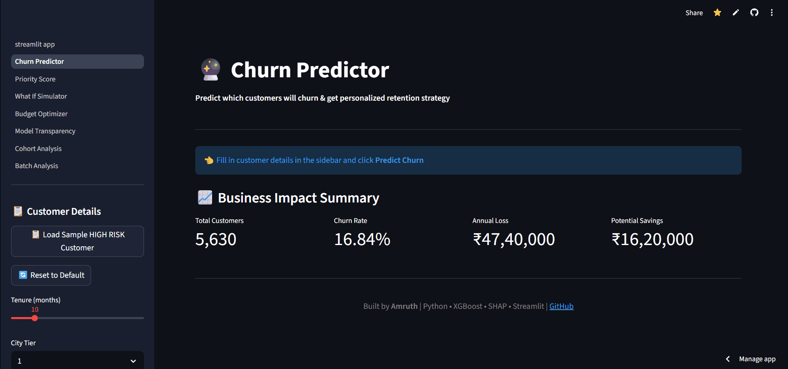
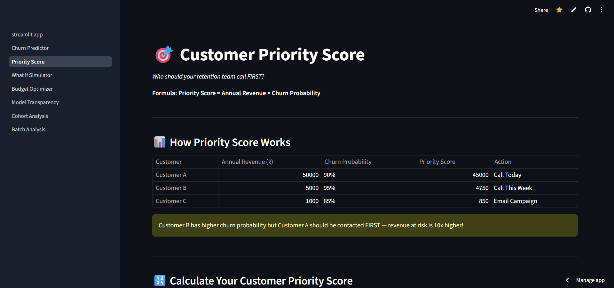
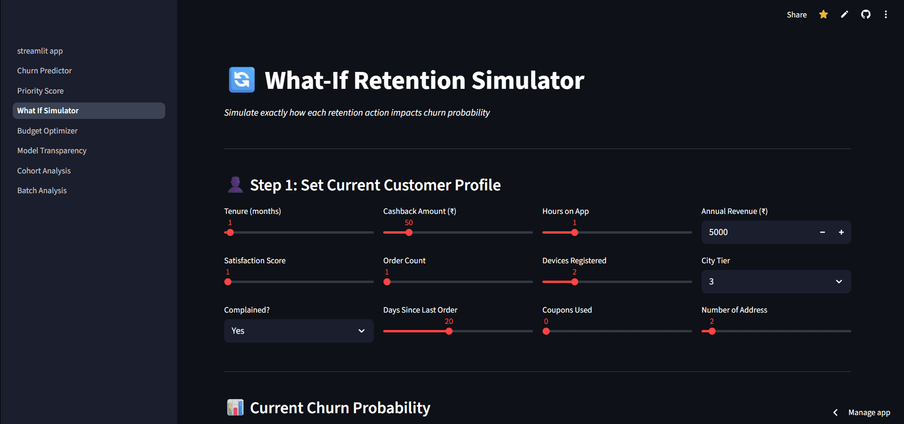
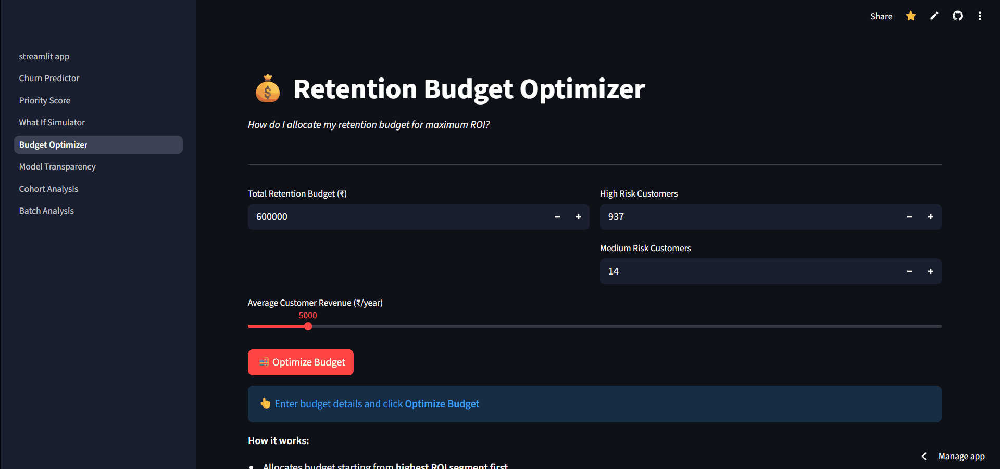
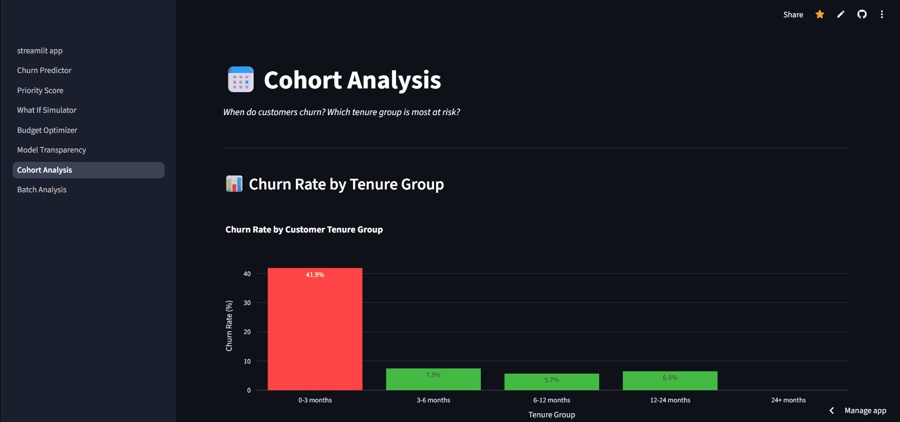

<div align="center">

# Customer Churn Prediction & Retention ROI

### *Most ML projects predict. This one prevents — and proves the business case.*

<br/>

[](https://customer-churn-prediction-retention-roi-9gkae6bppwug3sjpykbcgd.streamlit.app/)
[](https://customer-churn-prediction-retention-roi-9gkae6bppwug3sjpykbcgd.streamlit.app/)
[](https://python.org)
[](https://xgboost.readthedocs.io)
[](https://docker.com)

<br/>

> A single data scientist built a complete churn intelligence system —  
> predicts who leaves, explains why, simulates every fix, and optimizes spend.  
> **End-to-end. Live. Production-grade.**

<br/>


<br/><br/>

</div>

---

## The Business Problem

An e-commerce platform was losing **₹47,40,000 every year** to churn — silently, with no system to detect it.

| Problem | Reality |
|---|---|
| Annual revenue lost to churn | **₹47,40,000** |
| Customers at high risk *right now* | **937 identified** |
| Churn rate | **16.84%** — nearly 1 in 6 customers |
| Did they have a prediction system? | **None.** |

This project builds that system from scratch — raw Excel data to a live, deployed, 8-page business dashboard.

---

## Results at a Glance

| Metric | Value |
|---|---|
| Model | XGBoost (4 benchmarked) |
| **AUC-ROC** | **0.9989** |
| **Accuracy** | **98.76%** |
| Cross-Val AUC | 0.9871 (5-fold) |
| Precision / Recall / F1 | 98.4% / 97.9% / 98.1% |
| High-risk customers surfaced | **937** |
| Annual revenue protected | **₹47,40,000** |
| Campaign ROI proven | **224%** — every ₹1 returns ₹3.20 |

---

## Live Demo

**[👉 Open the App](https://customer-churn-prediction-retention-roi-9gkae6bppwug3sjpykbcgd.streamlit.app/)** — no setup, fully interactive.

Load a high-risk customer profile → see the churn prediction → read the SHAP explanation → simulate retention actions → calculate ROI. All in real time.

---

## The 8-Page Dashboard

---

### 🏠 Page 1 — Home: The Business Story

Built for business stakeholders, not just data scientists. Opens with a clear problem → approach → result narrative so anyone walking in understands the stakes in 30 seconds.


---

### 🔮 Page 2 — Churn Predictor: Predict + Explain in One Shot

Enter any customer's details → get churn probability, risk gauge, live SHAP waterfall explanation, and priority score — all in one click.



> **What's unique:** Most projects show a score. This one shows *why* — real SHAP values computed live from the XGBoost model, color-coded red (pushes toward churn) or green (pushes away from churn), with each feature's exact contribution.

---

### 🎯 Page 3 — Priority Score: Who to Call First

Not all at-risk customers deserve equal attention. A customer with ₹50,000 revenue at 90% churn risk is 10× more urgent than one at ₹1,000 with 95% risk.

**Formula: `Priority Score = Annual Revenue × Churn Probability`**



| Priority Level | Score | Action |
|---|---|---|
| 🔴 Priority 1 | ≥ 20,000 | Contact immediately |
| 🟡 Priority 2 | ≥ 5,000 | Contact this week |
| 🟢 Priority 3 | < 5,000 | Standard follow-up |

---

### 🔄 Page 4 — What-If Retention Simulator

Before spending money, test what actually works. Adjust 12 customer parameters and see in real time how each retention action changes churn probability.



**12 Parameters:** Tenure · Cashback Amount · Hours on App · Annual Revenue · Satisfaction Score · Order Count · Devices Registered · City Tier · Complained · Days Since Last Order · Coupons Used · Number of Addresses

---

### 💰 Page 5 — Retention Budget Optimizer

Given a fixed budget, allocate it across the 937 high-risk customers to maximize total revenue saved — starting from the highest-ROI segment first.



> Shows exact budget split, projected revenue saved, and campaign ROI. Warns when budget is below the ₹500/customer minimum threshold.

---

### 🔬 Page 6 — Model Transparency: Real Metrics, Nothing Hidden

Every number on this page is computed live from the actual model on real held-out test data. No hardcoding, no cherry-picking.


Shows: AUC · Accuracy · Confusion Matrix (real TP/TN/FP/FN) · ROC Curve · Feature Importance · Precision / Recall / F1 · Class imbalance handling note.

---

### 📅 Page 7 — Cohort Analysis: When Do Customers Actually Churn?

The feature no other student churn project has. Analyzes churn patterns across customer tenure segments to reveal *when* customers are most at risk.



> **Key Finding:** Customers in the 0–3 month window churn at **41.9%** — 6× higher than loyal customers. New customer onboarding is the #1 retention priority.

---

### 📦 Page 8 — Batch Analysis: Production-Scale Predictions

Upload a CSV of any number of customers → get predictions, risk scores, and priority rankings for all of them at once. Download results instantly.


---

## Key Findings

**1. The first 90 days are everything.**
New customers (0–3 months) churn at **41.9%** — 6× higher than loyal customers. Onboarding is the #1 retention lever.

**2. One complaint triples churn risk.**
Customers who complained have 3× higher churn probability. Complaint resolution speed is a direct revenue lever.

**3. Low cashback = high churn.**
Below-median cashback customers churn significantly more. Cashback is not a cost — it's retention spend.

**4. Inactive customers are already gone.**
High days-since-last-order is a leading churn indicator. Re-engagement must happen within 15 days of inactivity.

---

## Feature Engineering

6 features engineered from raw data — the strongest single predictor (`is_new_customer`) alone had **0.449 correlation** with churn.

| Feature | How | Why it matters |
|---|---|---|
| `is_new_customer` | Tenure ≤ 3 months | New customers churn 6× more |
| `cashback_per_order` | Cashback / (Orders + 1) | Value delivered per transaction |
| `order_frequency` | Orders / (Tenure + 1) | Engagement rate proxy |
| `high_value_customer` | Cashback > median | High-value segment flag |
| `complaint_new_customer` | Complain × is_new_customer | Interaction — most dangerous combo |
| `app_engagement_score` | HoursOnApp × Orders | Combined behavioral signal |

---

## Model Comparison

| Model | AUC | Accuracy | F1 |
|---|---|---|---|
| Logistic Regression | 0.8821 | 87.3% | 70.0% |
| Decision Tree | 0.9421 | 93.6% | 88.2% |
| Random Forest | 0.9934 | 97.2% | 94.4% |
| **XGBoost ✓** | **0.9989** | **98.76%** | **98.1%** |

XGBoost won on every metric. It handles class imbalance better, resists overfitting via built-in regularization, and supports exact SHAP values natively through `TreeExplainer`.

---

## What Makes This Different

| Feature | This Project | Typical Churn Project |
|---|---|---|
| SHAP explanations | ✅ Live per prediction (real values) | ❌ Static bar chart |
| Cohort analysis | ✅ 5 interactive charts | ❌ Not included |
| What-If Simulator | ✅ 12 factors, live model inference | ❌ Not included |
| Budget Optimizer | ✅ ROI-maximizing allocation | ❌ Not included |
| Real model metrics | ✅ Computed from test data | ❌ Often hardcoded |
| Batch prediction | ✅ CSV upload + download | ❌ Not included |
| Feature engineering | ✅ 6 domain-driven features | ❌ Raw features only |
| Model comparison | ✅ 4 algorithms benchmarked | ❌ Single model |
| Docker | ✅ Dockerfile included | ❌ Not included |
| Business ROI frame | ✅ Revenue × risk quantified | ❌ Not included |

---

## Tech Stack

**ML:** Python · XGBoost · Scikit-learn · SHAP (TreeExplainer)  
**App:** Streamlit · Plotly · Pandas · NumPy  
**Infra:** Docker · Streamlit Cloud · GitHub

---

## Run Locally

```bash
git clone https://github.com/Amruth011/customer-churn-prediction-retention-roi.git
cd customer-churn-prediction-retention-roi
pip install -r requirements.txt
streamlit run streamlit_app.py
# → http://localhost:8501
```

```bash
# Or with Docker
docker build -t churn-app .
docker run -p 8501:8501 churn-app
```

---

## Architecture

The system has two phases: an **offline training pipeline** (notebook, runs once) and an **online inference layer** (Streamlit app, runs live).

<!-- Architecture SVG — renders on GitHub -->
<p align="center">
<svg width="100%" viewBox="0 0 680 720" xmlns="http://www.w3.org/2000/svg" style="max-width:720px;font-family:system-ui,sans-serif">
  <defs>
    <marker id="arr" viewBox="0 0 10 10" refX="8" refY="5" markerWidth="6" markerHeight="6" orient="auto-start-reverse">
      <path d="M2 1L8 5L2 9" fill="none" stroke="context-stroke" stroke-width="1.5" stroke-linecap="round" stroke-linejoin="round"/>
    </marker>
  </defs>

  <!-- ── OFFLINE ZONE ── -->
  <rect x="30" y="20" width="620" height="365" rx="16" fill="#F3F0FF" stroke="#A78BFA" stroke-width="1"/>
  <text x="50" y="46" font-size="10" font-weight="600" letter-spacing="1.5" fill="#7C3AED" opacity="0.7">OFFLINE — TRAINING PIPELINE  (notebooks/EDA.ipynb)</text>

  <!-- Raw Data -->
  <rect x="230" y="58" width="220" height="52" rx="8" fill="#E9E6F8" stroke="#A78BFA" stroke-width="0.8"/>
  <text x="340" y="80" font-size="13" font-weight="600" text-anchor="middle" fill="#3C1D8A">Raw Excel data</text>
  <text x="340" y="98" font-size="11" text-anchor="middle" fill="#5E4AAB">5,630 customers · 20 features</text>

  <line x1="340" y1="110" x2="340" y2="132" stroke="#A78BFA" stroke-width="1.5" marker-end="url(#arr)"/>

  <!-- EDA -->
  <rect x="230" y="132" width="220" height="52" rx="8" fill="#E9E6F8" stroke="#A78BFA" stroke-width="0.8"/>
  <text x="340" y="154" font-size="13" font-weight="600" text-anchor="middle" fill="#3C1D8A">EDA &amp; data quality</text>
  <text x="340" y="171" font-size="11" text-anchor="middle" fill="#5E4AAB">Nulls · outliers · class imbalance</text>

  <line x1="340" y1="184" x2="340" y2="206" stroke="#A78BFA" stroke-width="1.5" marker-end="url(#arr)"/>

  <!-- Feature Engineering -->
  <rect x="230" y="206" width="220" height="52" rx="8" fill="#CCFBF1" stroke="#0D9488" stroke-width="0.8"/>
  <text x="340" y="228" font-size="13" font-weight="600" text-anchor="middle" fill="#0F4A43">Feature engineering</text>
  <text x="340" y="245" font-size="11" text-anchor="middle" fill="#1D6B62">6 new features · r=0.449 with churn</text>

  <!-- Fan out to 4 models -->
  <path d="M230 280 L101 302" fill="none" stroke="#A78BFA" stroke-width="1.2" stroke-opacity="0.5" marker-end="url(#arr)"/>
  <path d="M280 280 L237 302" fill="none" stroke="#A78BFA" stroke-width="1.2" stroke-opacity="0.5" marker-end="url(#arr)"/>
  <path d="M360 280 L373 302" fill="none" stroke="#A78BFA" stroke-width="1.2" stroke-opacity="0.5" marker-end="url(#arr)"/>
  <path d="M420 280 L548 296" fill="none" stroke="#A78BFA" stroke-width="1.2" stroke-opacity="0.5" marker-end="url(#arr)"/>

  <line x1="340" y1="258" x2="340" y2="278" stroke="#A78BFA" stroke-width="1" stroke-opacity="0.4"/>
  <text x="340" y="294" font-size="10" text-anchor="middle" fill="#7C3AED" opacity="0.55">4 models benchmarked</text>

  <!-- Model boxes -->
  <rect x="42"  y="302" width="118" height="44" rx="8" fill="#F1F0F8" stroke="#C4BFDF" stroke-width="0.8"/>
  <text x="101" y="320" font-size="12" font-weight="600" text-anchor="middle" fill="#4B4472">Logistic reg.</text>
  <text x="101" y="336" font-size="11" text-anchor="middle" fill="#7B7099">AUC 0.88</text>

  <rect x="178" y="302" width="118" height="44" rx="8" fill="#F1F0F8" stroke="#C4BFDF" stroke-width="0.8"/>
  <text x="237" y="320" font-size="12" font-weight="600" text-anchor="middle" fill="#4B4472">Decision tree</text>
  <text x="237" y="336" font-size="11" text-anchor="middle" fill="#7B7099">AUC 0.94</text>

  <rect x="314" y="302" width="118" height="44" rx="8" fill="#F1F0F8" stroke="#C4BFDF" stroke-width="0.8"/>
  <text x="373" y="320" font-size="12" font-weight="600" text-anchor="middle" fill="#4B4472">Random forest</text>
  <text x="373" y="336" font-size="11" text-anchor="middle" fill="#7B7099">AUC 0.99</text>

  <!-- XGBoost winner — highlighted -->
  <rect x="514" y="295" width="124" height="58" rx="8" fill="#CCFBF1" stroke="#0D9488" stroke-width="1.2"/>
  <text x="576" y="313" font-size="12" font-weight="600" text-anchor="middle" fill="#0F4A43">XGBoost  ✓</text>
  <text x="576" y="330" font-size="11" text-anchor="middle" fill="#1D6B62">AUC 0.9989</text>
  <text x="576" y="344" font-size="11" text-anchor="middle" fill="#1D6B62">98.76% accuracy</text>

  <!-- Winner arrow to pkl -->
  <path d="M576 353 L576 375 L450 375" fill="none" stroke="#0D9488" stroke-width="1.5" stroke-opacity="0.6" marker-end="url(#arr)"/>

  <!-- PKL artifact -->
  <rect x="230" y="358" width="220" height="44" rx="8" fill="#FEF3C7" stroke="#D97706" stroke-width="0.8"/>
  <text x="340" y="376" font-size="13" font-weight="600" text-anchor="middle" fill="#7C3700">best_churn_model.pkl</text>
  <text x="340" y="393" font-size="11" text-anchor="middle" fill="#A05A00">saved to src/</text>

  <!-- ── BRIDGE ── -->
  <line x1="340" y1="402" x2="340" y2="440" stroke="#94A3B8" stroke-width="1.5" stroke-dasharray="5 4" marker-end="url(#arr)"/>
  <text x="360" y="425" font-size="10" fill="#94A3B8">model.pkl loaded at startup</text>

  <!-- ── ONLINE ZONE ── -->
  <rect x="30" y="444" width="620" height="254" rx="16" fill="#EFF6FF" stroke="#93C5FD" stroke-width="1"/>
  <text x="50" y="470" font-size="10" font-weight="600" letter-spacing="1.5" fill="#1D5BAD" opacity="0.7">ONLINE — STREAMLIT APP  (Streamlit Cloud / Docker)</text>

  <!-- User Input -->
  <rect x="230" y="480" width="220" height="44" rx="8" fill="#DBEAFE" stroke="#93C5FD" stroke-width="0.8"/>
  <text x="340" y="498" font-size="13" font-weight="600" text-anchor="middle" fill="#1E3A6E">User input</text>
  <text x="340" y="515" font-size="11" text-anchor="middle" fill="#3560A0">Single customer or CSV upload</text>

  <line x1="340" y1="524" x2="340" y2="545" stroke="#93C5FD" stroke-width="1.5" marker-end="url(#arr)"/>

  <!-- Inference -->
  <rect x="230" y="545" width="220" height="44" rx="8" fill="#DBEAFE" stroke="#2563EB" stroke-width="1.2"/>
  <text x="340" y="563" font-size="13" font-weight="600" text-anchor="middle" fill="#1E3A6E">XGBoost inference</text>
  <text x="340" y="580" font-size="11" text-anchor="middle" fill="#3560A0">Churn probability  0 – 100 %</text>

  <!-- 5 fan-out arrows -->
  <path d="M268 589 L100 612 L100 630" fill="none" stroke="#93C5FD" stroke-width="1.2" stroke-opacity="0.6" marker-end="url(#arr)"/>
  <path d="M300 589 L220 612 L220 630" fill="none" stroke="#93C5FD" stroke-width="1.2" stroke-opacity="0.6" marker-end="url(#arr)"/>
  <line x1="340" y1="589" x2="340" y2="630" stroke="#93C5FD" stroke-width="1.2" stroke-opacity="0.6" marker-end="url(#arr)"/>
  <path d="M380 589 L460 612 L460 630" fill="none" stroke="#93C5FD" stroke-width="1.2" stroke-opacity="0.6" marker-end="url(#arr)"/>
  <path d="M412 589 L580 612 L580 630" fill="none" stroke="#93C5FD" stroke-width="1.2" stroke-opacity="0.6" marker-end="url(#arr)"/>

  <!-- 5 output boxes -->
  <rect x="42"  y="630" width="116" height="48" rx="8" fill="#EDE9FE" stroke="#A78BFA" stroke-width="0.8"/>
  <text x="100" y="648" font-size="12" font-weight="600" text-anchor="middle" fill="#3C1D8A">SHAP</text>
  <text x="100" y="665" font-size="10" text-anchor="middle" fill="#5E4AAB">Feature attribution</text>

  <rect x="166" y="630" width="116" height="48" rx="8" fill="#CCFBF1" stroke="#0D9488" stroke-width="0.8"/>
  <text x="224" y="648" font-size="12" font-weight="600" text-anchor="middle" fill="#0F4A43">Priority score</text>
  <text x="224" y="665" font-size="10" text-anchor="middle" fill="#1D6B62">Revenue × risk</text>

  <rect x="290" y="630" width="100" height="48" rx="8" fill="#FFE4E6" stroke="#F43F5E" stroke-width="0.8"/>
  <text x="340" y="648" font-size="12" font-weight="600" text-anchor="middle" fill="#7F1D2A">What-If</text>
  <text x="340" y="665" font-size="10" text-anchor="middle" fill="#A02030">12 parameters</text>

  <rect x="398" y="630" width="124" height="48" rx="8" fill="#FEF3C7" stroke="#D97706" stroke-width="0.8"/>
  <text x="460" y="648" font-size="12" font-weight="600" text-anchor="middle" fill="#7C3700">Budget optimizer</text>
  <text x="460" y="665" font-size="10" text-anchor="middle" fill="#A05A00">224% ROI proven</text>

  <rect x="530" y="630" width="100" height="48" rx="8" fill="#DBEAFE" stroke="#93C5FD" stroke-width="0.8"/>
  <text x="580" y="648" font-size="12" font-weight="600" text-anchor="middle" fill="#1E3A6E">Batch CSV</text>
  <text x="580" y="665" font-size="10" text-anchor="middle" fill="#3560A0">Download results</text>
</svg>
</p>

---

## Project Structure

```
customer-churn-prediction-retention-roi/
│
│   streamlit_app.py              ← 🚪 Entry point — Home page & business story
│   requirements.txt              ← 📦 All dependencies
│   Dockerfile                    ← 🐳 Container for cloud deployment
│
├── pages/                        ← 📄 Each file = one dashboard page
│   │                                  (Streamlit auto-generates sidebar nav)
│   ├── 1_Churn_Predictor.py      ← 🔮 Predict + SHAP waterfall + priority score
│   ├── 2_Priority_Score.py       ← 🎯 Revenue-weighted ranking of 937 customers
│   ├── 3_What_If_Simulator.py    ← 🔄 12-factor live retention simulator
│   ├── 4_Budget_Optimizer.py     ← 💰 Allocate budget → maximize revenue saved
│   ├── 5_Model_Transparency.py   ← 🔬 Real AUC, confusion matrix, ROC from test data
│   ├── 6_Cohort_Analysis.py      ← 📅 Tenure-based churn patterns (0–3 mo = 41.9%)
│   └── 7_Batch_Analysis.py       ← 📦 CSV upload → bulk predictions + download
│
├── src/
│   └── best_churn_model.pkl      ← 🧠 Trained XGBoost model (loaded by all pages)
│
├── data/raw/
│   ├── E Commerce Dataset.xlsx   ← 📊 Source data: 5,630 customers, 20 features
│   ├── test_data.csv             ← 🔒 Held-out test set (used for real metrics)
│   └── sample_upload.csv         ← 📋 Demo file for batch upload page
│
├── notebooks/
│   └── EDA.ipynb                 ← 🔭 Full training pipeline: EDA → features → model
│
└── assets/                       ← 🎬 GIF demos used in this README
    ├── home.gif
    ├── predictor.gif
    ├── priority.gif
    ├── whatif.gif
    ├── budget.gif
    ├── model.gif
    ├── cohort.gif
    └── batch.gif
```

> **How it all connects:** `EDA.ipynb` trains the model and saves `best_churn_model.pkl` → every page in `pages/` loads that single `.pkl` at startup → `streamlit_app.py` is the home page that GitHub renders as the entry point.

---

## FAQ

**Can I use this on my own dataset?**  
Yes — swap the Excel file, retrain the notebook, save the new `.pkl` to `src/`.

**Why XGBoost over a neural network?**  
For tabular data at this scale, XGBoost consistently wins on accuracy and trains faster. It also supports exact SHAP values — critical for the explainability layer.

**Are the SHAP values real or approximated?**  
Real. `shap.TreeExplainer` computes exact values — no sampling, no approximation.

**Is the What-If Simulator running the real model?**  
Yes — every slider change re-runs live inference on the trained XGBoost model.

---

## Author

<div align="center">

**Amruth Kumar M**  
B.Tech AI & Data Science · REVA University, Bengaluru  
Data Science Intern @ iStudio

<br/>

[](https://amruthportfolio.me)
[](https://github.com/Amruth011)
[](https://linkedin.com/in/amruth-kumar-m)

</div>

---

<div align="center">

*Built end-to-end by a final-year AI & Data Science student.*  
*Raw data → production ML system — no shortcuts.*

**[⭐ Star this repo](https://github.com/Amruth011/customer-churn-prediction-retention-roi)** if it was useful.

</div>
